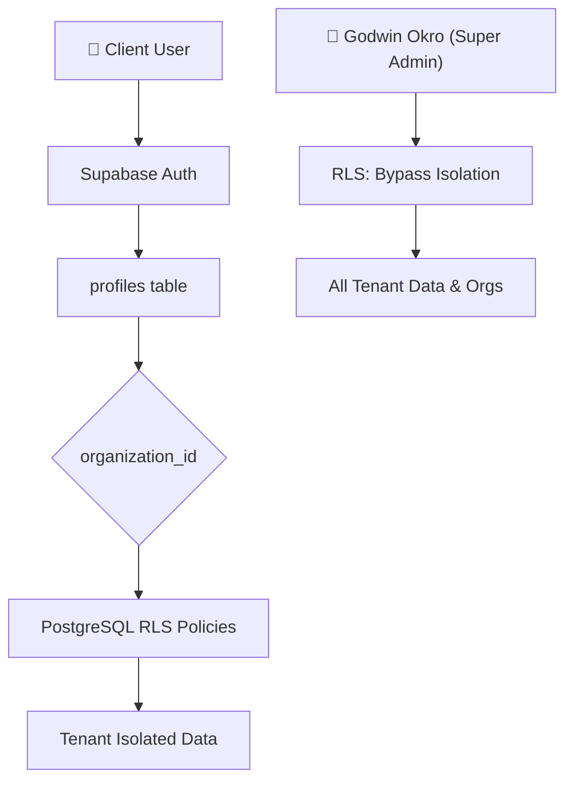

# StoreFlow by Flywheel — Knowledge Base

Welcome to the **StoreFlow by Flywheel** knowledge base. This project is a multi-tenant Stock Management & Accounting SaaS platform built from the ground up to support multiple business organizations.

---

## 🏗️ Architecture Overview (Full Serverless SaaS)

The platform is designed around a zero-maintenance, serverless architecture using Supabase and a single decoupled React frontend.

- **Frontend**: React (Vite, SPA) built for deployment on `ims.bookflywheel.com` or static hosting.
- **Backend & Database**: Supabase PostgreSQL with strict multi-tenant Row-Level Security (RLS). 
- **Serverless API**: Custom Deno Edge Functions for system actions (user invites, receipt sending, alerts).
- **Authentication**: Supabase Auth with profiles mapping users to roles and specific organizations.



---

## 🗄️ Multi-Tenancy & Data Isolation

Data isolation is enforced at the database layer via **Row-Level Security (RLS)**, making it impossible for one business to read or write another business's data.

### 1. The Tenant Model
* **`public.organizations`**: Stores tenant metadata including business name, slug, brand accent color, currency, admin contact email, and active status.
* **`public.profiles`**: Connects each user account to an organization via `organization_id` and defines their system permissions.
* **`public.platform_logs`**: Tracks cross-organization platform-wide activities visible only to the Super Admin.

### 2. Multi-Tenant Core Tables
All transactional and operational tables have an `organization_id` column and belong to a specific tenant:
* `products`, `sales`, `sale_items`, `customers`, `expenses`, `journal_entries`, `logs`.

### 3. RLS Helper Functions
To keep policies fast and easy to maintain, we use two PostgreSQL security definer functions:
* **`get_my_organization_id()`**: Retrieves the `organization_id` associated with the currently logged-in user.
* **`is_super_admin()`**: Returns `true` if the logged-in user has the `super_admin` role.

### 4. Enforced Policies
Every core table has the following policies:
* **Super Admin Override**: `USING (public.is_super_admin())` — grants the platform owner full platform management capabilities.
* **Tenant Isolation**: `USING (organization_id = public.get_my_organization_id())` — restricts users to their own organization's records.

---

## 🔑 Role-Based Access Control (RBAC)

User permissions are evaluated via the `role` column in the `profiles` table:

| Role | Scope | Description |
|---|---|---|
| **super_admin** | Platform-wide | Godwin (`godwinokro2020@gmail.com`). Full CRUD across all tenants, onboarding workflow, and platform-wide monitoring logs. |
| **admin** | Organization-scoped | Full CRUD control over their business's products, sales, reports, expenses, settings, and staff invites. |
| **storekeeper** | Organization-scoped | Day-to-day operations (sales creation, stock updates). Cannot delete records, edit products, or view financial reports. |
| **auditor** | Organization-scoped | Read-only auditor views for inventory history, accounting ledgers, and transactions. |

---

## ⚡ Serverless Edge Functions

StoreFlow features Deno-based Supabase Edge Functions to orchestrate transaction events securely:

1. **`invite-user`**: Called when inviting new staff. Creates auth credentials, configures the profile role, sets the `organization_id`, and sends a welcome email with customized HTML branding (matching their organization's name and color).
2. **`send-receipt`**: Triggered via a database webhook on sales inserts. Dynamically queries organization details (name, currency, brand color, admin contact) to compile and send transactional PDF receipts to customers.
3. **`send-low-stock-alert`**: Fired on product updates. Scopes alert distributions to admins within the same organization and formats notifications with tenant-specific branding.
4. **`_shared/resend.ts`**: Handles email delivery through Resend, dynamically rewriting the `from` email header using the tenant's business name.

---

## 🎨 Tenant Customization & Impersonation

* **Branded Theme**: The app dynamically loads the brand color (`primary_color`) from the tenant profile and injects it into document CSS variables (`--brand-color`).
* **Multi-Currency**: PDF receipts, WhatsApp receipt strings, and financial reports use the organization's custom `currency` (e.g., GHS, USD, NGN).
* **Super Admin Impersonation**: Super admins can click **Enter Shop** on any organization in their admin panel. The app stores an `impersonatedOrgId` in the Auth context to view that specific business's dashboard. A banner remains at the top to allow the super admin to return to `/admin`.

---

## 🚀 SaaS Setup & Deployment Guide

To deploy a new instance of StoreFlow:

### 1. Database Provisioning
1. Create a new project in your Supabase Dashboard.
2. Open the SQL Editor and execute the schema script located in:
   [prodSupabaseDB.sql](file:///c:/Users/gokro/Documents/GitHub/flywheel-storeflow/prodSupabaseDB.sql)
3. Execute any custom RPC triggers or index repair scripts as needed.

### 2. Set Up Edge Function Secrets
Set up secrets in your Deno Edge Function environment:
```bash
supabase secrets set RESEND_API_KEY="your-resend-key"
supabase secrets set SUPABASE_URL="your-supabase-project-url"
supabase secrets set SUPABASE_SERVICE_ROLE_KEY="your-service-role-key"
supabase secrets set APP_URL="https://ims.bookflywheel.com"
```
Deploy the functions:
```bash
supabase functions deploy invite-user
supabase functions deploy send-receipt
supabase functions deploy send-low-stock-alert
```

### 3. Elevate Super Admin Account
1. Register/Login with your admin email `godwinokro2020@gmail.com`.
2. Execute the following SQL statement in the Supabase Editor:
   ```sql
   UPDATE public.profiles 
   SET role = 'super_admin' 
   WHERE email = 'godwinokro2020@gmail.com';
   ```

### 4. Build and Launch
Configure your `.env.local` inside `client/` and launch the app:
```bash
npm run dev
```
Log in to your super admin account, navigate to `/admin` to onboard organizations, and begin scaling!
